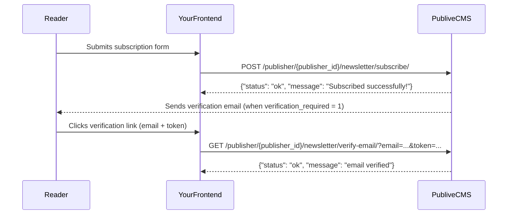

The Newsletter CMS API lets you build subscription flows for your Publive-powered publication. Use these endpoints to subscribe readers to newsletter groups, process unsubscriptions from campaign emails, and verify subscriber email addresses.

**Base URL:** `https://cms.thepublive.com/publisher/<PUBLISHER_ID>/`

## Endpoints

| Method | Path | Description |
| ------ | ---- | ----------- |
| `POST` | `newsletter/subscribe/` | Subscribe an email address to one or more newsletter groups |
| `POST` | `newsletter/unsubscribe/` | Unsubscribe a reader using an unsubscribe token |
| `GET` | `newsletter/verify-email/` | Verify a subscriber's email address |

## Subscription flow

## reCAPTCHA

Newsletter subscribe supports optional captcha verification. When your publisher has a `newsletter_captcha.secret_key` configured:

1. Include `check_for_captcha` (any truthy value) in the request body to trigger captcha validation.
2. Include `g-recaptcha-response` with the token from your frontend reCAPTCHA widget.
3. On successful verification, the backend sets `verification_required = 0` — the subscriber does not need to verify their email separately.

<Warning>
  If your publisher has no `newsletter_captcha.secret_key` configured but you send `check_for_captcha`, Google will reject the blank secret key and the request will return `400`.
</Warning>
