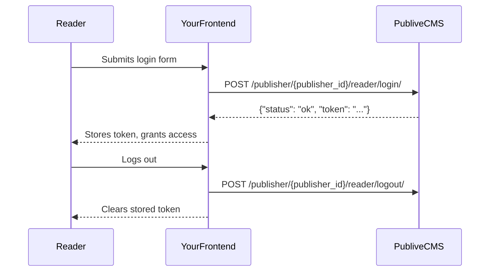
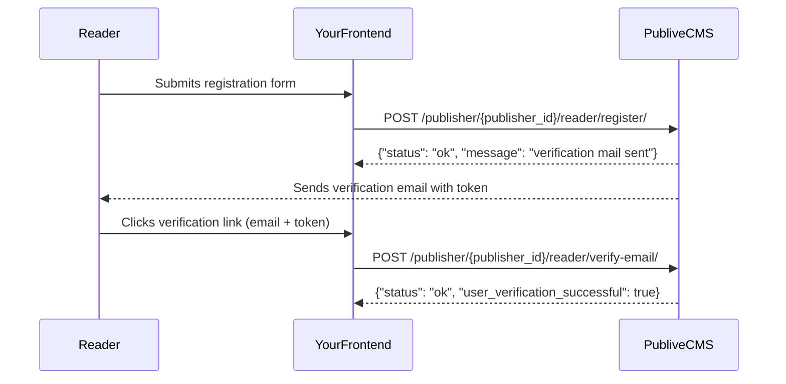

The Reader CMS API lets you build reader-facing authentication flows for your Publive-powered publication. Use these endpoints to handle reader sign-up, login, password recovery, and email verification.

**Base URL:** `https://cms.thepublive.com/publisher/<PUBLISHER_ID>/`

<Info>
  All Reader endpoints are scoped to your publisher via the `publisher_id` path parameter. The publisher is identified by the URL — no additional `Authorization` header is required for public flows such as register and forgot-password.
</Info>

## Endpoints

| Method | Path | Description |
| ------ | ---- | ----------- |
| `POST` | `reader/login/` | Authenticate a reader and return a session token |
| `POST` | `reader/logout/` | Invalidate the current reader session (client-side) |
| `POST` | `reader/register/` | Create a new reader account |
| `POST` | `reader/forgot-password/` | Send a password reset email |
| `PATCH` | `reader/reset-password/` | Set a new password using a reset token |
| `POST` | `reader/verify-email/` | Verify a reader's email address |

## Authentication flow

## Registration and email verification flow

