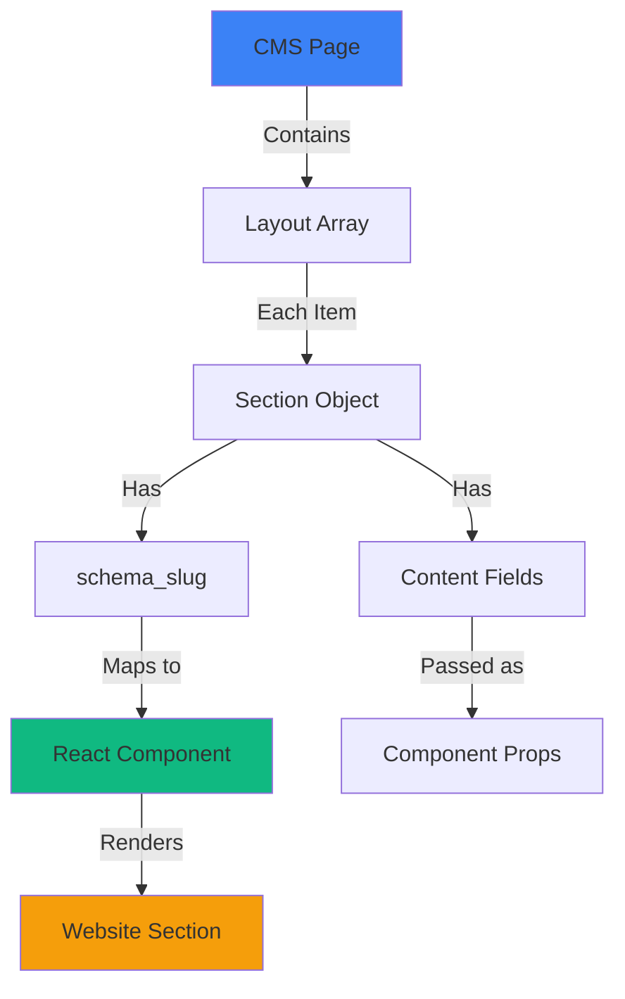

This guide shows you how to build a brand website using Publive's Decoupled Frontend Infrastructure. You'll learn how to:

- Set up the brand website starter
- Create brand pages in Publive CMS
- Build reusable layout sections
- Register and render custom components
- Deploy your changes to production

## Prerequisites

Before you begin, ensure you have completed onboarding and received:

<Check>
  **GitHub Repository Access** - Clone access to your brand starter repo
</Check>

<Check>
  **Publive CMS Access** - Login credentials to the CMS dashboard
</Check>

<Check>
  **Publisher Credentials** - API keys and secrets for authentication
</Check>

<Check>
  **Environment Mapping** - Branch-to-environment mapping (e.g., `beta` → staging, `main` → production)
</Check>

<Check>
  **Deployment URL** - Live URL where your site will be hosted
</Check>

## Step 1: Run the Starter Locally

### Clone the Repository

```bash
git clone git@github.com:ThePublive/pl-brand-starter.git
cd pl-brand-starter
```

<Note>
  Replace `pl-brand-starter` with your actual repository name provided during onboarding.
</Note>

### Install Dependencies

```bash
npm install
```

### Configure Environment Variables

Copy the sample environment file:

```bash
cp .env.sample .env
```

Add your credentials to `.env`:

```bash .env
NEXT_PUBLIC_PL_PUBLISHER_ID=your-publisher-id
NEXT_PUBLIC_PL_PUBLISHER_API_KEY=your-api-key
NEXT_PUBLIC_PL_PUBLISHER_API_SECRET=your-api-secret
NEXT_PUBLIC_PL_ENVIRONMENT=production
NEXT_PUBLIC_APP_URL=https://your-domain.com
```

### Start Development Server

```bash
npm run dev
```

Open your browser to:

```
http://localhost:3000
```

<Check>
  You now have a working brand website powered by Publive CMS data!
</Check>

## Step 2: Understand the Brand Page Model

Brand pages in Publive are built from **layout sections** - reusable building blocks that you can arrange in any order.

### Page Structure

Each brand page contains:

<ResponseField name="metadata" type="object">
  Page-level information like title, slug, and SEO fields
</ResponseField>

<ResponseField name="layout" type="array">
  Ordered list of section components that make up the page
</ResponseField>

### Section Structure

Each layout section has:

<ResponseField name="schema_slug" type="string" required>
  Unique identifier for the section type (e.g., `hero-banner-image`)
</ResponseField>

<ResponseField name="fields" type="object" required>
  Structured content fields specific to that section type
</ResponseField>

### Rendering Flow

<Frame>
  
</Frame>



The website automatically:

1. Reads the `layout` array from CMS
2. Finds the matching React component for each `schema_slug`
3. Passes the section's fields as props to the component
4. Renders components in the specified order

## Step 3: Create Your First Brand Page

### In Publive CMS

<Steps>
  <Step title="Open Content Type">
    Navigate to your brand pages content type in the CMS
  </Step>
  <Step title="Verify Layout Field">
    Ensure the content type has a **layout** (dynamic zone) field
  </Step>
  <Step title="Create New Page">
    Click "Create New Entry" to start a new brand page
  </Step>
  <Step title="Add Metadata">
    Fill in basic information:

    - **Title**: Page title for SEO
    - **Slug**: URL path (e.g., `about-us`)
    - **Meta Description**: SEO description
  </Step>
  <Step title="Add Layout Sections">
    Click "Add Section" in the layout field and choose from available section types
  </Step>
  <Step title="Publish">
    Click "Publish" to make your page live
  </Step>
</Steps>

<Check>
  Your page will now render automatically on your website at the slug you specified!
</Check>

## Step 4: Add Sections to Your Page

Sections are reusable building blocks. Let's create a hero banner section as an example.

### Define Section in CMS

<Steps>
  <Step title="Create Section Schema">
    In CMS, create a new section schema with these fields:

    ```yaml
    schema_slug: hero-banner-image
    fields:
      - name: heading
        type: text
        required: true
      - name: sub_text
        type: text
        required: false
      - name: description
        type: rich-text
        required: false
      - name: banner
        type: media
        required: false
    ```
  </Step>
  <Step title="Add to Page Layout">
    In your brand page, add this section to the layout field
  </Step>
  <Step title="Fill Content">
    Populate the section fields with your content:

    - Heading: "Welcome to Our Brand"
    - Sub text: "Building the future"
    - Upload a banner image
  </Step>
</Steps>

## Step 5: Build the Matching Component

Create a React component that matches the CMS fields **exactly**.

### Create Component File

```tsx components/sections/HeroBannerImage.tsx
import { Media } from "publive-cms-sdk";
import Image from "next/image";

interface HeroBannerImageProps {
  heading: string;
  sub_text?: string;
  description?: string;
  banner?: Media;
}

export default function HeroBannerImage({
  heading,
  sub_text,
  description,
  banner,
}: HeroBannerImageProps) {
  return (
    <section className="relative h-[600px] w-full">
      {/* Background Image */}
      {banner && (
        <div className="absolute inset-0">
          <Image
            src={banner.url}
            alt={banner.alt_text || heading}
            fill
            className="object-cover"
            priority
          />
          <div className="absolute inset-0 bg-black/40" />
        </div>
      )}

      {/* Content */}
      <div className="relative z-10 flex h-full items-center justify-center">
        <div className="max-w-4xl text-center text-white">
          <h1 className="mb-4 text-5xl font-bold">{heading}</h1>
          
          {sub_text && (
            <p className="mb-6 text-xl font-light">{sub_text}</p>
          )}
          
          {description && (
            <div 
              className="prose prose-invert"
              dangerouslySetInnerHTML={{ __html: description }}
            />
          )}
        </div>
      </div>
    </section>
  );
}
```

<Warning>
  **Critical Rule**: Component prop names MUST match CMS field names exactly. If CMS uses `sub_text`, your component must use `sub_text` (not `subText` or `subtitle`).
</Warning>

## Step 6: Register the Section

Map the section slug to your component in the configuration file.

### Update Configuration

```tsx publive.config.ts
import HeroBannerImage from "@/components/sections/HeroBannerImage";

export const componentRegistry = {
  "hero-banner-image": {
    component: HeroBannerImage,
  },
  // Add more sections here...
};
```

Now, when CMS sends a layout item with:

```json
{
  "schema_slug": "hero-banner-image",
  "heading": "Welcome to Our Brand",
  "banner": { ... }
}
```

The website automatically renders the `HeroBannerImage` component with those props.

## Step 7: Create Custom Sections

Follow this workflow to build new sections from scratch:

<Steps>
  <Step title="Design Section">
    Create or review the design in Figma or design tool
  </Step>
  <Step title="Define CMS Schema">
    Create the section schema in CMS with a unique `schema_slug`

    ```yaml
    schema_slug: testimonial-carousel
    fields:
      - name: title
        type: text
      - name: testimonials
        type: repeater
        fields:
          - name: quote
            type: text
          - name: author
            type: text
          - name: avatar
            type: media
    ```
  </Step>
  <Step title="Build React Component">
    Create a component matching the CMS fields

    ```tsx
    interface TestimonialCarouselProps {
      title: string;
      testimonials: Array<{
        quote: string;
        author: string;
        avatar?: Media;
      }>;
    }
    ```
  </Step>
  <Step title="Register Component">
    Add to `publive.config.ts`:

    ```tsx
    "testimonial-carousel": {
      component: TestimonialCarousel,
    }
    ```
  </Step>
  <Step title="Add to CMS Page">
    Add the section to a page's layout field in CMS
  </Step>
  <Step title="Test & Verify">
    Check the section renders correctly with all field variations
  </Step>
</Steps>

<Info>
  This loop is how brand websites scale. Each new section becomes a reusable building block.
</Info>

## Step 8: Validate Your Page

Before deploying, verify:

<AccordionGroup>
  <Accordion title="Section Order">
    ✅ Sections render in the same order as the CMS layout array
  </Accordion>
  <Accordion title="Optional Fields">
    ✅ Optional fields don't break rendering when empty

    ```tsx
    {sub_text && <p>{sub_text}</p>}
    ```
  </Accordion>
  <Accordion title="Images">
    ✅ Images load correctly with proper alt text ✅ Image optimization is working (Next.js Image component)
  </Accordion>
  <Accordion title="Links & Navigation">
    ✅ All links function correctly ✅ Navigation works between pages
  </Accordion>
  <Accordion title="Draft vs Published">
    ✅ Draft content only shows in preview mode ✅ Published content appears on live site
  </Accordion>
</AccordionGroup>

## Step 9: Deploy Your Changes

### Standard Deployment Workflow

<Steps>
  <Step title="Create Feature Branch">
    ```bash
    git checkout -b feature/add-testimonial-section
    ```
  </Step>
  <Step title="Commit Changes">
    ```bash
    git add .
    git commit -m "feat: add testimonial carousel section"
    ```
  </Step>
  <Step title="Push to Remote">
    ```bash
    git push -u origin feature/add-testimonial-section
    ```
  </Step>
  <Step title="Create Pull Request">
    Open a PR on GitHub to your environment branch (e.g., `beta` or `main`)
  </Step>
  <Step title="Review & Merge">
    After code review, merge the PR
  </Step>
  <Step title="Automatic Deployment">
    CI/CD automatically deploys the latest version to your live URL
  </Step>
</Steps>

### Branch → Environment Mapping

Confirm your branch-to-environment mapping during onboarding:

```bash
beta → Staging Environment (staging.yourdomain.com)
main → Production Environment (yourdomain.com)
```

<Warning>
  Merging to `main` triggers immediate production deployment. Always test in staging first!
</Warning>

## Common Section Patterns

### Text Content Section

```tsx
interface TextContentProps {
  title: string;
  content: string; // Rich text HTML
}
```

### Image Gallery Section

```tsx
interface ImageGalleryProps {
  title?: string;
  images: Media[];
  layout: "grid" | "carousel";
}
```

### Call-to-Action Section

```tsx
interface CTASectionProps {
  heading: string;
  description?: string;
  primary_button: {
    text: string;
    url: string;
  };
  secondary_button?: {
    text: string;
    url: string;
  };
}
```

### Team Section

```tsx
interface TeamSectionProps {
  title: string;
  team_members: Array<{
    name: string;
    role: string;
    bio?: string;
    photo?: Media;
    linkedin?: string;
  }>;
}
```

## Best Practices

<CardGroup cols={2}>
  <Card icon="shield-check" title="Type Safety">
    Define TypeScript interfaces for all section props
  </Card>
  <Card icon="tag" title="Prop Naming">
    Match CMS field names exactly in component props
  </Card>
  <Card icon="circle-question" title="Optional Fields">
    Handle optional fields gracefully with conditional rendering
  </Card>
  <Card icon="image" title="Image Optimization">
    Always use Next.js Image component for automatic optimization
  </Card>
  <Card icon="recycle" title="Reusability">
    Design sections to be reusable across multiple pages
  </Card>
  <Card icon="vial" title="Testing">
    Test all field variations (required, optional, empty states)
  </Card>
</CardGroup>

## Next Steps

<CardGroup cols={2}>
  <Card icon="blocks" href="/guides/component-library" title="Component Library">
    Explore pre-built section components
  </Card>
  <Card icon="paintbrush" href="/guides/styling" title="Styling Guide">
    Learn styling best practices for sections
  </Card>
  <Card icon="magnifying-glass" href="/guides/seo" title="SEO Optimization">
    Optimize your brand pages for search engines
  </Card>
  <Card icon="gauge-high" href="/guides/performance" title="Performance">
    Performance optimization techniques
  </Card>
</CardGroup>

## Troubleshooting

<AccordionGroup>
  <Accordion title="Section not rendering">
    **Possible causes:**

    - `schema_slug` mismatch between CMS and config
    - Component not exported correctly
    - Prop name mismatch between CMS fields and component

    **Solution:** Check browser console for errors and verify naming matches exactly.
  </Accordion>
  <Accordion title="Images not loading">
    **Possible causes:**

    - Image URL not accessible
    - Missing Next.js Image domain configuration

    **Solution:** Add CMS domain to `next.config.js`:

    ```js
    images: {
      domains: ['cdn.publive.com'],
    }
    ```
  </Accordion>
  <Accordion title="Styling not applied">
    **Possible causes:**

    - CSS modules not imported
    - Tailwind classes not generated

    **Solution:** Ensure CSS is imported and Tailwind config includes your component paths.
  </Accordion>
</AccordionGroup>

## Support

Need help building your brand website?

- **Documentation**: [API Reference](/api-reference)
- **Support Email**: [support@publive.com](mailto:support@publive.com)
- **Community**: [Publive Community Forum](https://help.thepublive.com/)