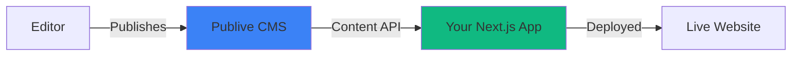

## What is Decoupled Frontend Infrastructure?

Publive's Decoupled Frontend Infrastructure lets you build **your own website** (Next.js, custom UI, custom logic) while using **Publive CMS** solely for content management and publishing.

### Why Use Decoupled Infrastructure

<CardGroup cols={2}>
  <Card title="Full Control" icon="sliders">
    Complete ownership over frontend code, UI/UX, and infrastructure
  </Card>
  <Card title="No Template Lock-in" icon="unlock">
    Build custom layouts and branding without shared templates
  </Card>
  <Card title="Independent Deployments" icon="rocket">
    Deploy frontend changes without touching the CMS
  </Card>
  <Card title="Optimized Performance" icon="gauge-high">
    SSR, Edge rendering, and custom performance optimizations
  </Card>
</CardGroup>

### Problems This Solves

- **Custom Layouts & Branding**: Design unique experiences tailored to your brand
- **Publisher-Specific Workflows**: Implement workflows that match your editorial process
- **Performance Requirements**: Leverage SSR, Edge computing, or custom caching strategies
- **Independent Scaling**: Scale frontend and CMS independently based on traffic patterns

## What Can You Build?

Decoupled Frontend Infrastructure is ideal for:

<CardGroup cols={3}>
  <Card title="📰 News & Media" icon="newspaper">
    High-traffic news websites with real-time updates
  </Card>
  <Card title="🏷️ Brand Websites" icon="store">
    Marketing and corporate websites with custom designs
  </Card>
  <Card title="📖 Editorial Platforms" icon="book-open">
    Blogs and content-rich publishing platforms
  </Card>
</CardGroup>

<Info>
If you can build it with Next.js, you can power it with Publive CMS.
</Info>

## Architecture Overview



### Data Flow

1. **Content Creation**: Editors publish content in Publive CMS
2. **API Exposure**: CMS exposes content via REST/GraphQL APIs
3. **Frontend Rendering**: Your Next.js app fetches and renders content
4. **Deployment**: Changes pushed to GitHub trigger automatic deployments

## Publisher Lifecycle

<Steps>
  <Step title="Onboarding">
    Publive engineers provide:
    - Publisher credentials (API keys and secrets)
    - GitHub repository access with target branches
    - Live app URL for production environment
    
    ```bash
    # Credentials provided during onboarding
    PUBLISHER_ID=your-publisher-id
    API_KEY=your-api-key
    API_SECRET=your-api-secret
    ```
  </Step>

  <Step title="Custom Development">
    Build your custom website with full ownership of:
    - Code and business logic
    - UI/UX design
    - Application structure
    - Feature implementation
  </Step>

  <Step title="Deployment">
    Push changes to GitHub → CI/CD automatically deploys to your live environment
    
    <Note>
    Full CI/CD documentation available in [Deployment Guide](/guides/deployment)
    </Note>
  </Step>

  <Step title="Go Live">
    Your website is accessible via the provided URL and ready to serve traffic
  </Step>
</Steps>

## Starter Kit

### What's Included

<CardGroup cols={2}>
  <Card title="Next.js Foundation" icon="react">
    Pre-configured Next.js project with best practices
  </Card>
  <Card title="CMS Integration" icon="plug">
    Content Delivery SDK configured and ready to use
  </Card>
  <Card title="Basic Fetching" icon="download">
    Sample content fetching patterns and examples
  </Card>
  <Card title="Production Ready" icon="circle-check">
    Configured for local development and production deployment
  </Card>
</CardGroup>

### Prerequisites

Before you begin, ensure you have:

- **Node.js**: LTS version (18.x or higher)
- **Next.js Knowledge**: Basic understanding of React and Next.js
- **Publive Access**: Valid publisher credentials from onboarding
- **Git**: Familiarity with Git workflow

## Quick Start

<Steps>
  <Step title="Clone the Repository">
    ```bash
    git clone <starter-repo-url>
    cd <project-name>
    npm install
    ```
  </Step>

  <Step title="Configure Environment">
    Copy the sample environment file:
    ```bash
    cp .env.sample .env
    ```
    
    Update `.env` with your onboarding credentials:
    ```bash
    NEXT_PUBLIC_PL_PUBLISHER_ID=your-publisher-id
    NEXT_PUBLIC_PL_PUBLISHER_API_KEY=your-api-key
    NEXT_PUBLIC_PL_PUBLISHER_API_SECRET=your-api-secret
    ```
  </Step>

  <Step title="Start Development Server">
    ```bash
    npm run dev
    ```
    
    Your decoupled website is now running at `http://localhost:3000`
  </Step>
</Steps>

<Check>
You now have a working decoupled website running locally and connected to Publive CMS!
</Check>

## Deploying Changes

### Development Workflow

<Steps>
  <Step title="Create Feature Branch">
    ```bash
    git checkout -b feature/your-feature-name
    ```
  </Step>

  <Step title="Make Changes">
    Develop your features locally and test thoroughly
  </Step>

  <Step title="Commit & Push">
    ```bash
    git add .
    git commit -m "feat: your feature description"
    git push -u origin feature/your-feature-name
    ```
  </Step>

  <Step title="Create Pull Request">
    Open a PR to your target branch (e.g., `main` or `production`)
  </Step>

  <Step title="Auto-Deploy">
    Once merged, CI/CD automatically deploys to your live URL
  </Step>
</Steps>

<Warning>
Always test changes locally before pushing to production branches. Merged PRs trigger immediate deployments.
</Warning>

## Next Steps

Choose a path based on your use case:

<CardGroup cols={2}>
  <Card title="Build a News Website" icon="newspaper" href="/guides/build-news-media">
    Learn how to build a high-performance news/media website
  </Card>
  <Card title="Build a Brand Website" icon="palette" href="/guides/build-brand-website">
    Create a custom brand website with dynamic sections
  </Card>
</CardGroup>

## Support & Resources

<CardGroup cols={2}>
  <Card title="API Reference" icon="book" href="/api-reference">
    Complete API documentation for content fetching
  </Card>
  <Card title="SDK Documentation" icon="code" href="/sdks/javascript">
    JavaScript SDK reference and examples
  </Card>
  <Card title="Deployment Guide" icon="rocket" href="/guides/deployment">
    CI/CD configuration and deployment best practices
  </Card>
  <Card title="Get Help" icon="life-ring" href="mailto:support@publive.com">
    Contact our support team for assistance
  </Card>
</CardGroup>