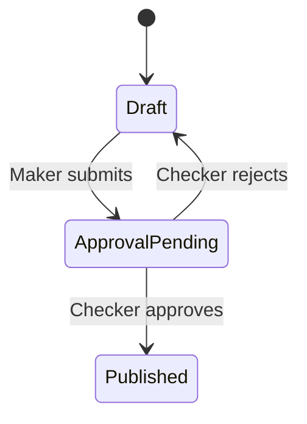

The maker-checker pattern ensures that content created by one member (maker) must be reviewed and approved by another member (checker) before publication. This is essential for regulated industries like BFSI and Pharmaceuticals.

## How it works

1. **Maker** creates or edits a post and sets status to `Approval Pending`
2. **Checker** reviews the post in the Publive Dashboard
3. **Checker** approves (sets to `Published`) or rejects (sets back to `Draft`)

## Implementation via API

### Step 1: Create a post as draft

```bash
curl -X POST \
  'https://cms.thepublive.com/publisher/<PUBLISHER_ID>/post/' \
  -H 'Authorization: Basic <BASE64_AUTH_TOKEN>' \
  -H 'Content-Type: application/json' \
  -d '{
    "title": "Quarterly Financial Report Q4 2025",
    "english_title": "Quarterly Financial Report Q4 2025",
    "type": "Article",
    "status": "Draft",
    "primary_category": 100,
    "content": "<p>Financial results for Q4 2025...</p>"
  }'
```

### Step 2: Submit for Approval

```bash
curl -X PATCH \
  'https://cms.thepublive.com/publisher/<PUBLISHER_ID>/post/50200/' \
  -H 'Authorization: Basic <BASE64_AUTH_TOKEN>' \
  -H 'Content-Type: application/json' \
  -d '{"status": "Approval Pending"}'
```

### Step 3: Approve and Publish

```bash
curl -X PATCH \
  'https://cms.thepublive.com/publisher/<PUBLISHER_ID>/post/50200/' \
  -H 'Authorization: Basic <BASE64_AUTH_TOKEN>' \
  -H 'Content-Type: application/json' \
  -d '{"status": "Published"}'
```

## Post status flow



<Info>
The `approver` field in the post response shows who approved the content.
</Info>
