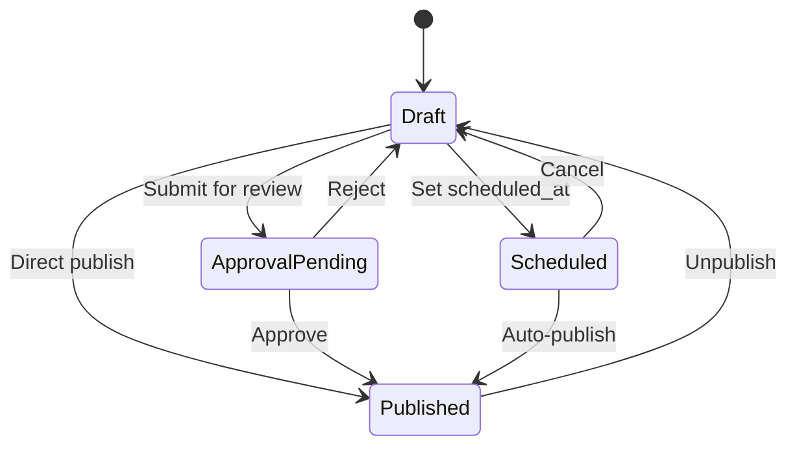

Understanding how content moves through different states is key to building reliable integrations with Publive.

## State diagram



## Valid state transitions

| From | To | Notes |
| ---- | -- | ----- |
| `Draft` | `Approval Pending` | Submit for review |
| `Draft` | `Published` | Direct publish (if permissions allow) |
| `Draft` | `Scheduled` | Requires `scheduled_at` datetime |
| `Approval Pending` | `Published` | Approved by checker |
| `Approval Pending` | `Draft` | Rejected by checker |
| `Published` | `Draft` | Unpublish content |
| `Scheduled` | `Draft` | Cancel scheduled publish |
| `Scheduled` | `Published` | Auto-triggered at `scheduled_at` time |

## Checking post status

Use the CMS API to check current status:

```bash
curl -X GET \
  'https://cms.thepublive.com/publisher/<PUBLISHER_ID>/post/<POST_ID>/' \
  -H 'Authorization: Basic <BASE64_AUTH_TOKEN>'
```

The response includes:

```json
{
  "id": 50123,
  "title": "My Article",
  "status": "Published",
  "published_at": "2026-02-01T09:00:00Z",
  "created_at": "2026-01-28T14:00:00Z",
  "updated_at": "2026-02-01T09:00:00Z",
  "approver": {"id": 5, "name": "Editor"},
  "source": "HeadlessCMS"
}
```

## Access control

The `access_type` field in `meta_data` controls content visibility:

| Value | Description |
| ----- | ----------- |
| `Free` | Publicly accessible to all readers |
| `Paid` | Behind paywall, requires subscription |

```bash
# Set content as paid/premium
curl -X PATCH \
  'https://cms.thepublive.com/publisher/<PUBLISHER_ID>/post/<POST_ID>/' \
  -H 'Authorization: Basic <BASE64_AUTH_TOKEN>' \
  -H 'Content-Type: application/json' \
  -d '{"meta_data": {"access_type": "Paid"}}'
```
